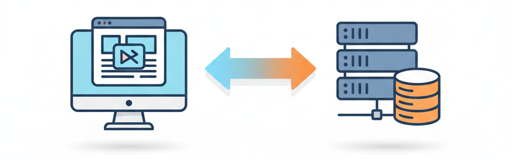

<!-- _class: center -->
<!-- _header: "" -->
<!-- _paginate: skip -->

# バイブコーダーに贈るフロントエンド開発入門

## はじめに - AI 時代のフロントエンド開発

---

## 講座概要

この講座は、**バイブコーディング**（AI を活用したコーディングスタイル）を実践する人に向けた、**フロントエンド開発**の入門講座です。

受講後は以下の状態を目指します。

- **AI に的確な指示を出せる**
- **AI が生成したコードを怖がらずに読むことができる**
- **AI が生成したコードを自分で修正できる**

---

## 従来の講座との違い

| 従来の講座                     | この講座                           |
| ------------------------------ | ---------------------------------- |
| すべてのコードを自分で書く前提 | AI と協働する前提                  |
| 暗記重視                       | 理解と応用重視                     |
| 完璧な実装を目指す             | 効率的な AI への指示と修正を目指す |
| 技術単体の学習                 | 実践的な組み合わせ                 |

---

## 受講によって得られるもの

- AI との共通言語：HTML/CSS/JavaScript の基礎を理解し、的確な指示が出せる
- コードリーディング力：AI が生成したコードを評価・修正できる
- 創造性の拡張：技術的な可能性を知り、アイデアの幅が広がる
- 開発効率の向上：自分で微調整できるため、AI とのやり取りが最小化
- 実践力：実際のプロジェクトで使える技術の習得

---

## フロントエンドとバックエンド

フロントエンド（クライアントサイド）

- ユーザーが見る部分
- HTML / CSS / JavaScript
- ブラウザで動作
- 見た目・ユーザー操作を担当

バックエンド（サーバーサイド）

- 裏側で動く部分
- Web サーバー / データベース
- サーバーで動作
- データ処理・保存・認証などを担当

---

## なぜ AI 時代の今、フロントエンド開発を学ぶの？

「AI がコードを書いてくれるのに、わざわざ学ぶ必要ある？」
この疑問、めちゃくちゃ正しい視点！でも答えは **「だからこそ学ぶべき」** なんだ。

### AI 時代に基礎を学ぶ 3 つの理由

- AI との**対話力が向上**する

  - 基礎知識があれば、AIへの指示がより具体的になる

- AI が生成したコードを**評価・改善**できる

  - コードの良し悪しが判断でき、自分で細かい調整ができる

- 創造性の幅が広がる

  - 「こんな表現ができる」を知ってると、アイデアが湧く

###### より効率的・効果的に AI を活用することができる

---

## カリキュラム構成

### Phase 1: HTML/CSS 基礎編 🏛️

- HTML/CSS で文書を作る方法を学ぶ

### Phase 2: HTML/CSS 発展編 🎨

- HTML/CSS の基礎を土台に、実践的でインタラクティブなレイアウトを作る方法を学ぶ

### Phase 3: JavaScript 基礎編 ⚡️

- 動きのある Web ページを作るため、プログラミングの基礎を学ぶ

### Phase 4: JavaScript 発展編 🎮

- 本格的な Web アプリを作るため、実践的で高度な JavaScript テクニックを学ぶ

### Phase 5: CSS フレームワーク編 🎯

- Bootstrap と Tailwind CSS を使って、効率的なスタイリング方法を学ぶ

### Phase 6: 統合プロジェクト 🚀

- AI と協働して、ゼロから本格的なWebアプリケーションを作り上げるプロセスを学ぶ

---

## 開発環境

### 必要なもの

- コードエディタ：Visual Studio Code（推奨）、Cursor、Antigravity など

  - 拡張機能：Live Preview（推奨）

- ブラウザ：Chrome、Firefox、Safari など（開発者ツールが使える）
- AI：ChatGPT、Gemini、Claude など

### あると便利なもの

- コード管理ツール：Git/GitHub

---

## 学習のマインドセット 💡

1. **完璧を目指さない**

    - 最初から全部覚える必要はない
    - AI に聞きながら、少しずつ理解を深めていこう

2. **手を動かす**

    - AI に指示して、生成されたコードを観察する
    - 読むだけじゃなく、実際にコードを書いてみる

3. **楽しむ**

    - 「こんなデザインができた！」を楽しもう
    - 試行錯誤のプロセス自体を楽しむ

4. **質問する習慣**

    - わからないことは AI に聞く
